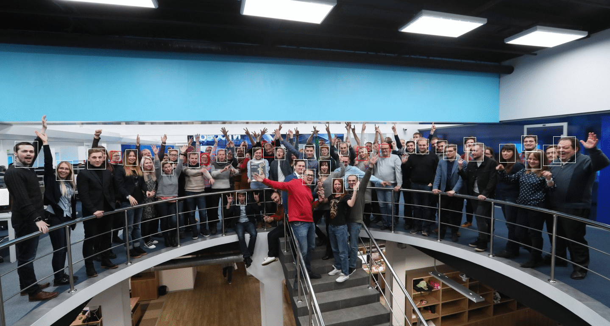

# Face D.A.R.S.
Система обнаружения и распознавания лиц на python с использованием tensorflow



# Технологии
* [MTCNN](https://github.com/ipazc/mtcnn) - Нахождение лиц
* [FaceNet](https://github.com/davidsandberg/facenet) - Распознавание лиц
* Tensorflow - Математика нейросетей
* OpenCV - Работа с изображениями

# Установка

```cd /srv```

```git clone git@github.com:izvestia/python-facedars.git```

```cd /srv/python-facedars```

```python3 -m pip install -r requirements.txt``` 

# Запуск

* ## Обнаружение лиц на фото

```python3 face_detection_image_demo.py``` - Получить лица из тестового фото ```demo/detection_image/input/people.jpg```

Этот скрипт найдёт лица и разложит их по директориям ```demo/detection_image/output/faces/{selected|rejected}```

* В selected попадут лица, в которых система уверенна

* В rejected попадут смазанные лица и другой мусор

* Фото ```demo/detection_image/output/people-detected.jpg``` будет с размеченными лицами
* Фото ```demo/detection_image/output/people-marked.jpg``` будет размеченными точками лиц (рот, нос, глаза)

* ## Обнаружение лиц на видео


```python3 face_detection_video_demo.py``` - Логика такая же как и с фото, 
только вместо фото будут использоваться кадры из тестового видео ```demo/detection_video/input/miss-russia.mp4```

Этот скрипт найдёт лица и разложит их по директориям ```demo/detection_video/output/faces/{selected|rejected}```

* В selected попадут лица, в которых система уверенна

* В rejected попадут смазанные лица и другой мусор

* В директорию ```demo/detection_video/output/frames/``` попадут кадры видео с разметкой найденных лиц

* ## Распознование лиц на видео


```python3 face_recognition_video_demo.py``` - Логика такая же как и в ```python3 face_detection_video_demo.py```
Только теперь лица будут сверяться с лицами из дерикторий ```demo/people```

* В директорию ```demo/recognition_video/output/frames/``` попадут кадры видео с разметкой найденных и распознанных лиц
* В директорию ```demo/recognition_video/output/faces/recognized/``` попадут распознанные лица

# Устранение ошибок
ValueError: Object arrays cannot be loaded when allow_pickle=False

```python3 -m pip install numpy==1.16.1```

ImportError: cannot import name 'abs'

```python3 -m pip uninstall -y tensorflow```

```python3 -m pip uninstall -y protobuf```

```find ~/.local/ -name "tensorflow" | xargs -Ipkg rm -rfv pkg```

```python3 -m pip install tensorflow==1.12.3```
